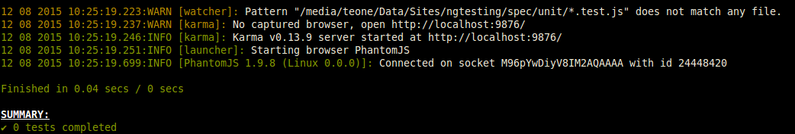

# ngTesting

This is an example application to be tested with **Karma** and **Protractor**

## Start the app

Clone the repository

Run `npm install`

Run `npm start`

## Check for errors

Run `npm run lint`

## Setting Up the environment for Karma

In order to execute Unit Tests we need:

- A test runner (Karma)
- An assertion library (Jasmine)
- A browser in which run the tests (PhantomJs)
- A configuration File
- One spec (at least)
- A script to run the test

To install the necessary tools run:

`npm install jasmine-core karma karma-jasmine karma-mocha-reporter karma-ng-html2js-preprocessor karma-phantomjs-launcher phantomjs --save-dev`

### Create a Spec Folder

Create a new folder to hold your spec:

`mkdir spec; mkdir spec/unit`

### The Karma configuration file

It is possible to automatically generate this file with `karma init`, for more information visit: http://karma-runner.github.io/0.8/intro/configuration.html

You will be asked for:

- Assertion Framework (jasmine)
- Usage of require.js (no)
- Browser (PhantomJs)
- Files Location (src/js/**/*.js) then add the other location later
    + _You need to add, all the files (framework, modules, scripts, test)_
- Exclude files (empty)
- Watch (yes)

#### Some improvement to the generated config

Set a `basePath` to `./`

Add this files to the list:

- `'src/vendor/angular/angular.min.js',`
- `'src/vendor/angular-route/angular-route.min.js',`
- `'src/vendor/angular-google-maps/dist/angular-google-maps.min.js',`
- `'src/vendor/lodash/lodash.min.js',`
- `'src/vendor/angular-mocks/angular-mocks.js',`
- `'src/js/main.js',`
- `'src/js/*.js',`
- `'spec/unit/*.test.js'`

Change the reporte from `progress` to `mocha`

### Create the default `npm test` script

In the `package.json` file, within the `scripts` section, add:

`"test": "karma start"`

### Running the tests

As you have defined a `npm test` script, you can execute your test with this command, if everything has worked you should see:

